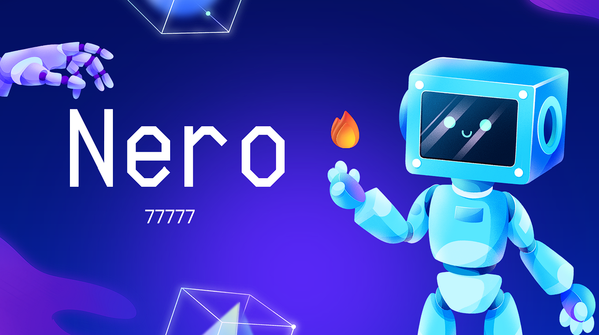

# Nero🔥 - Retrieval-Augmented Generation Chatbot

## About
Nero🔥 is a Retrieval-Augmented Generation Chatbot developed during the HackItAll hackathon organized by Liga Studenților din Facultatea de Automatică și Calculatoare București (LSAC București). The chatbot is designed to provide responses to questions from documents, overcoming the limitations of traditional chatbots with static datasets. It allows for dynamic interaction and can work with private data, making it potentially scalable to enterprise applications in the future.

## Features
- Retrieves relevant information from documents to generate responses to user queries.
- Provides dynamic and contextually relevant answers, enhancing user experience.
- Addresses the static dataset nature of classical chatbots, offering more versatile interactions.
- Can potentially scale to enterprise applications by handling private data securely.

## Usage
1. Clone the repository: `git clone https://github.com/AndreasBaschir/77777.git`
2. Install dependencies: `pip install -r requirements.txt`
3. Input your OpenAi API key -- Line 15 in `Nero.py`
4. Run the chatbot: `streamlit run Nero.py`
5. Interact with Nero🔥 by asking questions and observing its responses.

## Acknowledgements
- LSAC București: Organizers of the HackItAll hackathon for providing the platform for innovation and collaboration.
- BCR: Sponsorship and mentorship during the competition, contributing to the success of the project.

## Future Development
- Implement additional features to enhance the chatbot's capabilities.
- Improve response generation algorithms for more accurate and contextually relevant answers.
- Explore integration with external APIs and services for broader functionality.
- Conduct user testing and gather feedback for iterative improvements.

## Contributors
- Andreas Baschir
- Alexandru Crăciun
- Alexandru-Valentin Samson

Feel free to contribute to the project by forking the repository and submitting pull requests!

